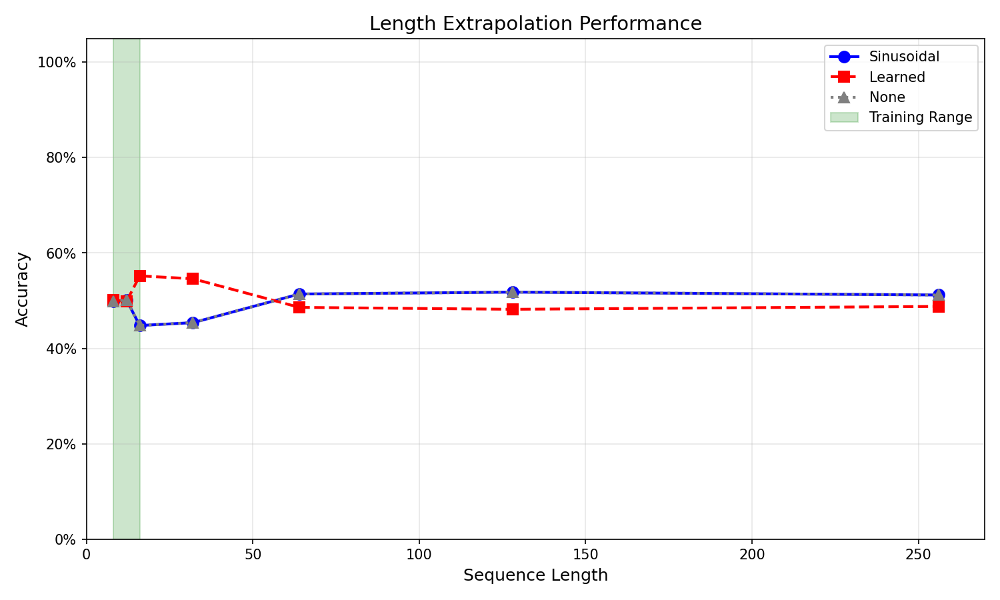
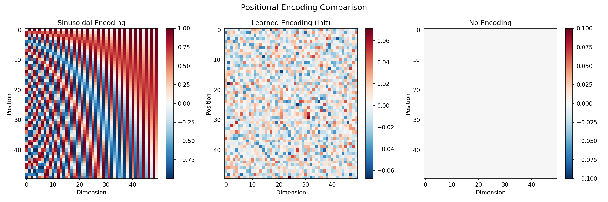
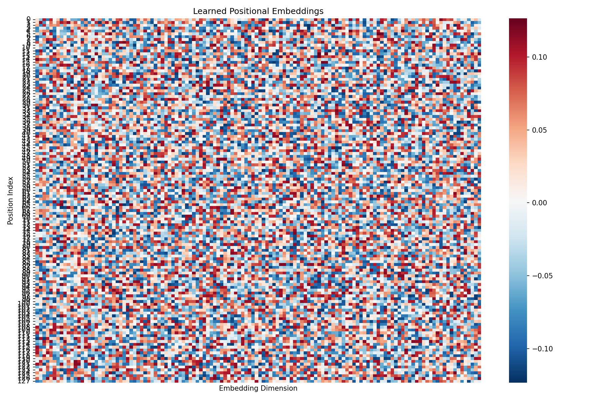

## Problem 1

### Attention pattern visualizations

Each figure shows all attention heads; darker cells indicate higher attention weights.

Examples:

### Head ablation study: which heads are critical vs redundant?

- Baseline accuracy: 41.20%.
- Accuracy when ablating individual heads is recorded per layer and module (encoder, decoder self, decoder cross).
- The largest drops are concentrated in decoder self-attention, especially deeper layers.

Top head importance by accuracy drop (higher = more critical):

| Rank | Module        | Layer | Head | Acc Drop |
| ---: | ------------- | ----: | ---: | -------: |
|    1 | Decoder Self  |     1 |    3 |   0.2090 |
|    2 | Decoder Self  |     1 |    2 |   0.1905 |
|    3 | Decoder Self  |     1 |    1 |   0.1855 |
|    4 | Decoder Self  |     0 |    3 |   0.1440 |
|    5 | Decoder Self  |     1 |    0 |   0.0500 |
|    6 | Decoder Cross |     0 |    0 |   0.0480 |
|    7 | Encoder       |     1 |    3 |   0.0120 |
|    8 | Decoder Self  |     0 |    2 |   0.0145 |

Labels in the plot follow: "Encoder Lx Hy", "Decoder Self Lx Hy", "Decoder Cross Lx Hy".

### Discussion: How do attention heads specialize for carry propagation?

- Encoder heads mostly show small impact when ablated (less than 1.2% absolute drop), suggesting they primarily provide general context encoding (e.g., token type/operator awareness) rather than decisive sequence computation.
- Decoder self-attention heads in the deeper layer (layer 1) are critical; ablating them yields large drops (up to ~21%). This pattern is consistent with heads specializing in tracking carry information and aligning generated digits with prior partial sums.
- Cross-attention is mixed: many heads are redundant (no measurable drop), but at least one (layer 0, head 0) contributes moderately (~4.8% drop), likely mediating alignment between source digits and the current decoding position.

### Quantitative pruning result

- Criterion for “minimal accuracy loss”: absolute accuracy drop ≤ 0.01.
- Total heads: 24 (2 encoder layers × 4 heads + 2 decoder self × 4 + 2 decoder cross × 4).
- Heads prunable under this criterion: 14 / 24 ≈ 58.3% (most encoder and cross-attention heads; decoder self-attention heads are largely non-prunable).

---

---

## Problem 2

### Extrapolation curves

Accuracy vs. sequence length for all three positional encodings.

For reference, a direct visual comparison of encoding patterns:

### Why does sinusoidal extrapolate but learned fails?

- Definition (Fourier features): Let $\omega_i = 10000^{-2i/d}$. The sinusoidal table is
  $P_{t,2i} = \sin(\omega_i t),\; P_{t,2i+1} = \cos(\omega_i t)$, for any integer position $t \ge 0$. This defines a function $P: \mathbb{N} \to \mathbb{R}^d$ with no dependence on training length.
- Relative-position signal: Using the identity $\sin a\,\sin b + \cos a\,\cos b = \cos(a-b)$, the positional inner product satisfies
  $P_t^\top P_s = \sum_i \cos\big(\omega_i (t-s)\big)$, which depends only on the displacement $\Delta=t-s$. After linear maps $W_Q, W_K$, any attention logit term of the form $(P_t W_Q) (P_s W_K)^\top$ becomes a linear combination of $\cos(\omega_i\Delta)$. Hence attention can learn translation-equivariant kernels $g(\Delta)$ that generalize to unseen absolute indices.
- Smooth spectrum and extrapolation: The set $\{\cos(\omega_i\Delta)\}$ spans low-to-moderate frequencies. Learned weights interpolate these harmonics for new $\Delta$ without requiring new parameters, so the same kernel applies at longer lengths.
- Learned absolute embeddings: A table $E\in\mathbb{R}^{L_{\text{max}}\times d}$ defines vectors only for indices seen during training (e.g., $t\in[0,L_{\text{train}}-1]$). For $t\ge L_{\text{train}}$, common strategies are (i) clamp $E_t=E_{L_{\text{train}}-1}$ or (ii) random/untrained vectors. In both cases, dot products $E_t^\top E_s$ are not a function of $t-s$ and introduce distribution shift; with clamping, many long positions collapse to the same vector, destroying relative information.
- Consequence in attention: With sinusoidal PE, the logit between positions $t,s$ has a stable component $g(t-s)$ learned during training, so the model preserves ordering cues beyond the training span. With learned PE, logits depend on absolute IDs; when new IDs appear, that mapping is undefined or degenerate, leading to failures at long lengths.

### Learned position embedding visualization

Heatmap of the learned absolute embeddings.

### Quantitative comparison (accuracy)

Accuracies at extrapolation lengths 32, 64, 128, 256.

| Length | Sinusoidal | Learned |  None |
| -----: | ---------: | ------: | ----: |
|     32 |      0.454 |   0.546 | 0.454 |
|     64 |      0.514 |   0.486 | 0.514 |
|    128 |      0.518 |   0.482 | 0.518 |
|    256 |      0.512 |   0.488 | 0.512 |
