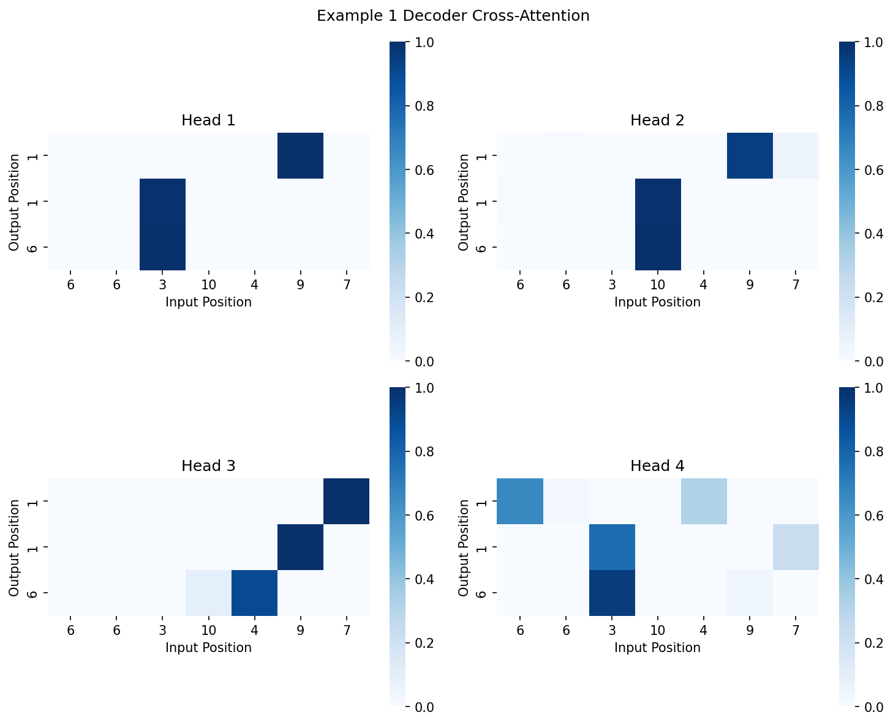
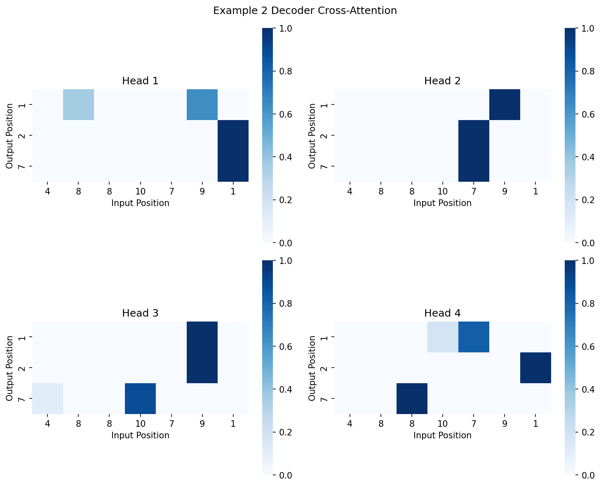
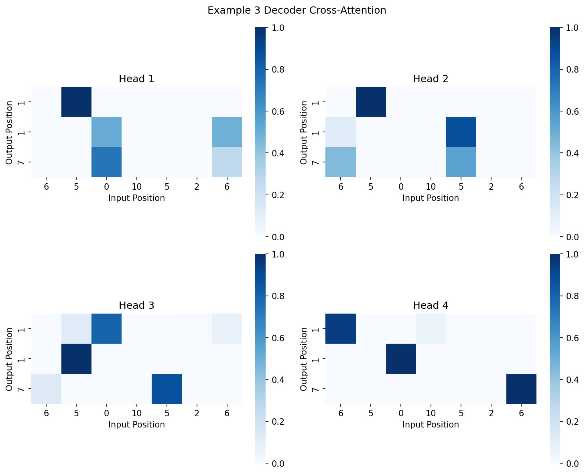
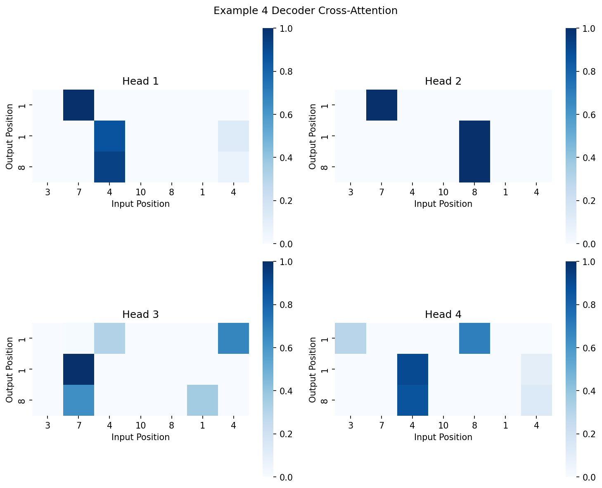
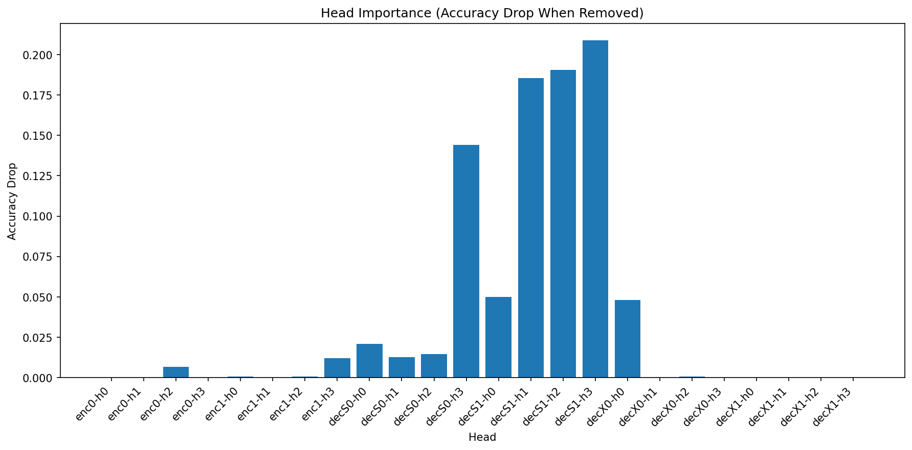

## Problem 1 — Attention Analysis Brief Report

### Attention pattern visualizations

Each figure shows all attention heads; darker cells indicate higher attention weights.

Examples:

### Head ablation study: which heads are critical vs redundant?

- Baseline accuracy: 41.20%.
- Accuracy when ablating individual heads is recorded per layer and module (encoder, decoder self, decoder cross).
- The largest drops are concentrated in decoder self-attention, especially deeper layers.

Top head importance by accuracy drop (higher = more critical):

| Rank | Module        | Layer | Head | Acc Drop |
| ---: | ------------- | ----: | ---: | -------: |
|    1 | Decoder Self  |     1 |    3 |   0.2090 |
|    2 | Decoder Self  |     1 |    2 |   0.1905 |
|    3 | Decoder Self  |     1 |    1 |   0.1855 |
|    4 | Decoder Self  |     0 |    3 |   0.1440 |
|    5 | Decoder Self  |     1 |    0 |   0.0500 |
|    6 | Decoder Cross |     0 |    0 |   0.0480 |
|    7 | Encoder       |     1 |    3 |   0.0120 |
|    8 | Decoder Self  |     0 |    2 |   0.0145 |

Labels in the plot follow: "Encoder Lx Hy", "Decoder Self Lx Hy", "Decoder Cross Lx Hy".

### Discussion: How do attention heads specialize for carry propagation?

- Encoder heads mostly show small impact when ablated (less than 1.2% absolute drop), suggesting they primarily provide general context encoding (e.g., token type/operator awareness) rather than decisive sequence computation.
- Decoder self-attention heads in the deeper layer (layer 1) are critical; ablating them yields large drops (up to ~21%). This pattern is consistent with heads specializing in tracking carry information and aligning generated digits with prior partial sums.
- Cross-attention is mixed: many heads are redundant (no measurable drop), but at least one (layer 0, head 0) contributes moderately (~4.8% drop), likely mediating alignment between source digits and the current decoding position.

### Quantitative pruning result

- Criterion for “minimal accuracy loss”: absolute accuracy drop ≤ 0.01.
- Total heads: 24 (2 encoder layers × 4 heads + 2 decoder self × 4 + 2 decoder cross × 4).
- Heads prunable under this criterion: 14 / 24 ≈ 58.3% (most encoder and cross-attention heads; decoder self-attention heads are largely non-prunable).
